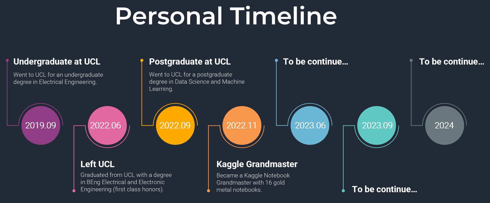

# What can you find in my github?

### **`A Complete Guide to Machine Learning Models`** :

  - Beginner friendly tutorial notebooks on traditional machine learning models
  - The notebooks were once posted on Kaggle and had received over 16 gold metals

### **`Advanced-Machine-Learning-Skills`** :

  - Tutorial notebooks on technqiues useful for solving machine learning problems
  - Three main areas: hyperparameter tuning, feature engineering, and Data Preprocessing

### **`Machine-Learning-Books`** :

  - Books I read on data science and machine learning 
  - Notes I made when reading the books, including relevant codes

 ### **`Kaggle-Competitions`** :
 
  - Solutions and codes to the featured Kaggle competitions I completed
  - Each competition was explained in detailed and easy to understand without extra knowledge
 
 
 ### **` UCL-MSc-DSML`** :
 
  - Lecture Notes, Coursework Solutions, Projects for the MSc Data Science and Machine Learning course I completed at UCL
