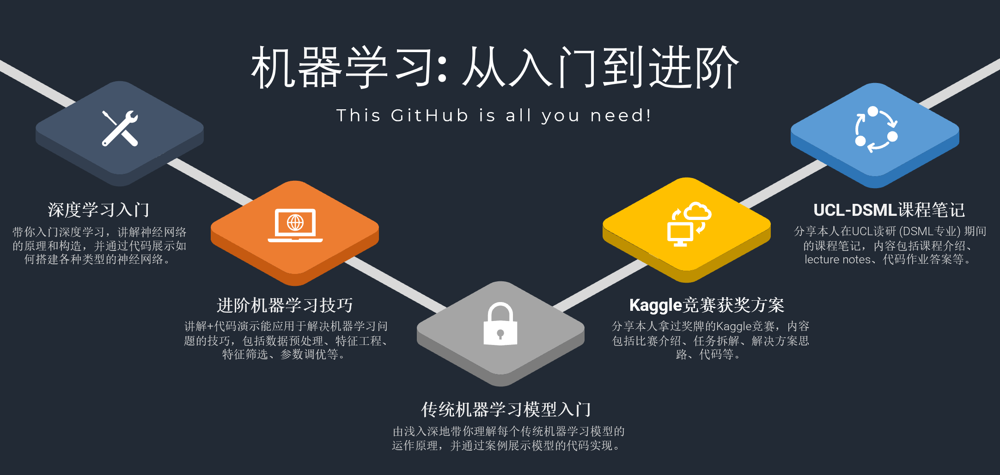

# What can you find in my github?

### **[A Complete Guide to Machine Learning Models](https://github.com/ryanluoli1/A-Complete-Guide-to-Machine-Learning-Models)** :

  - Beginner friendly **tutorial notebooks** on traditional machine learning models
  - The notebooks were once **gold metal notebooks** on Kaggle each with over 100 upvotes

### **[Advanced Machine Learning Skills](https://github.com/ryanluoli1/Advanced-Machine-Learning-Skills)** :

  - Tutorial notebooks on **technqiues** useful for solving machine learning problems
  - Three main areas: **hyperparameter tuning**, **feature engineering**, and **Data Preprocessing**

### **[Kaggle Competitions](https://github.com/ryanluoli1/Kaggle-Competitions)** :
 
  - **Solutions and codes** to the featured Kaggle competitions I completed
  - Each competition was **explained in detailed** and easy to understand without extra knowledge
 
 
### **[Introduction to Deep Learning](https://github.com/ryanluoli1/Introduction-to-Deep-Learning)** :
 
  - Beginner friendly **Tutorial notebooks** on deep learning
  - State-of-the-art deep learning **models and techniques** 

### **[Machine Learning Books and Papers](https://github.com/ryanluoli1/Machine-Learning-Books-and-Papers)** :

  - **Books and papers** I read on data science and machine learning 
  - **Notes** I made when reading them (including relevant codes)
 
 
### **[UCL-MSc-DSML](https://github.com/ryanluoli1/UCL-MSc-DSML)** :
 
  - Lecture Notes, Coursework Solutions, Projects for the **MSc Data Science and Machine Learning** course I completed at **UCL**
